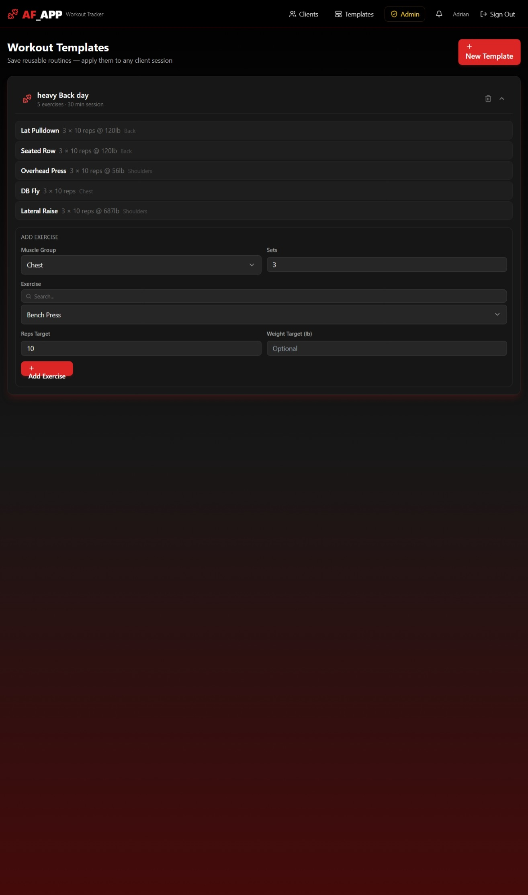
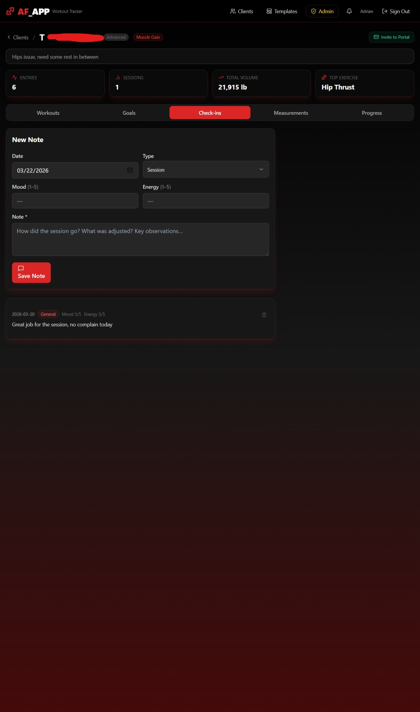
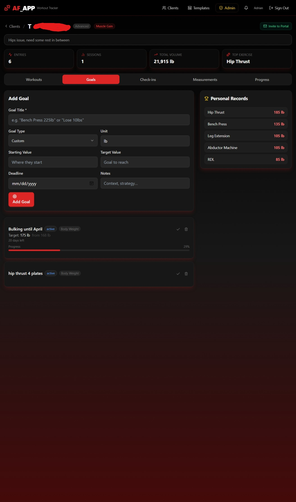
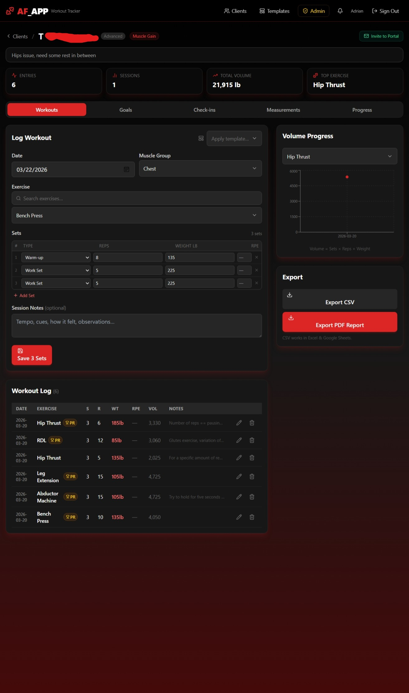
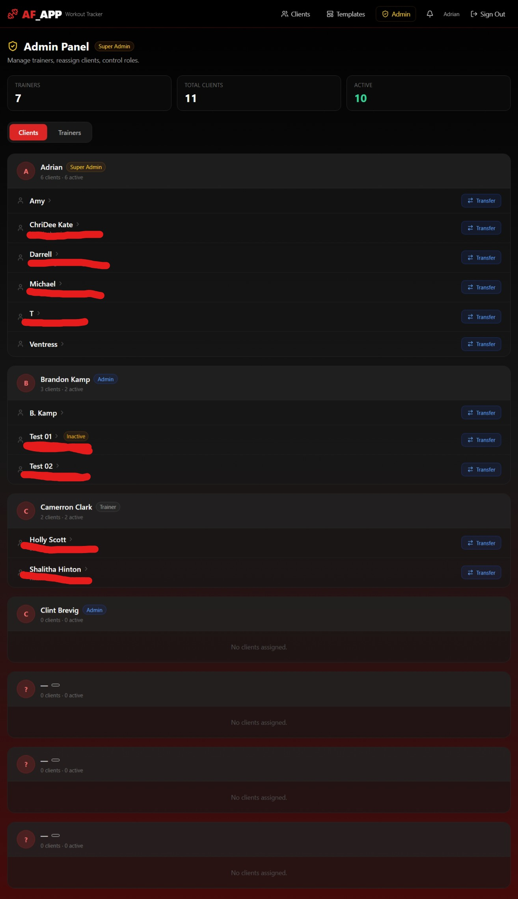
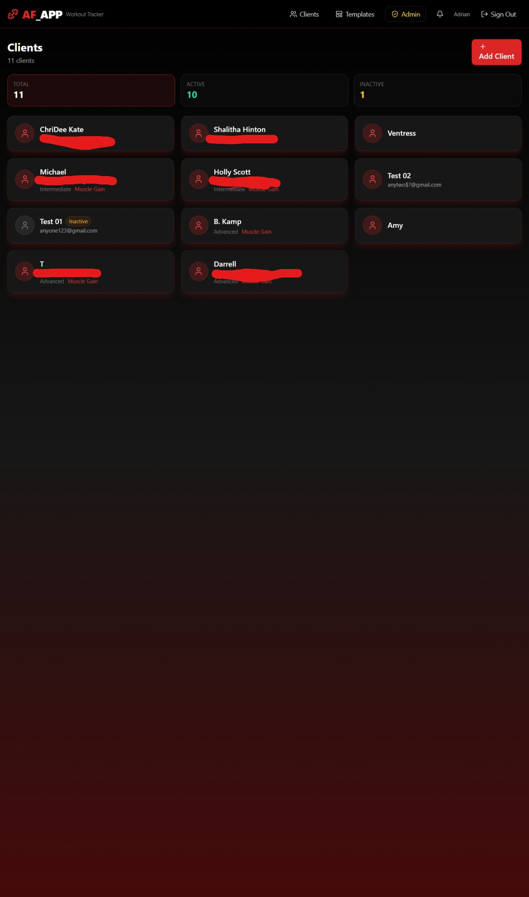
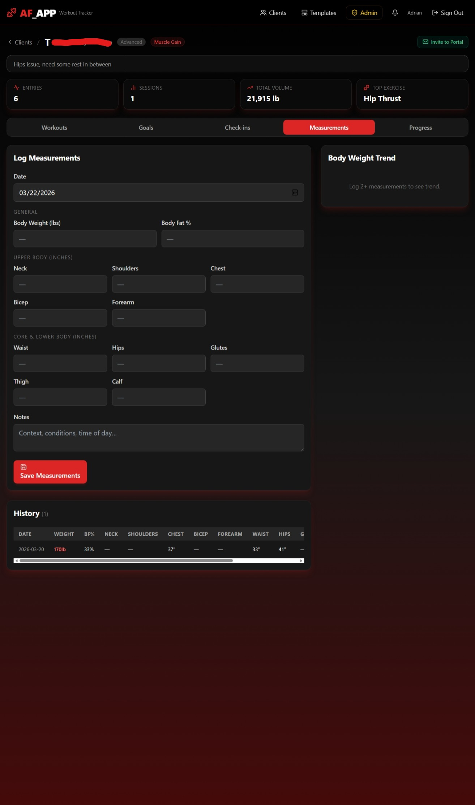
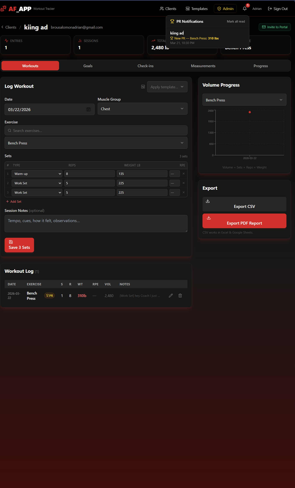
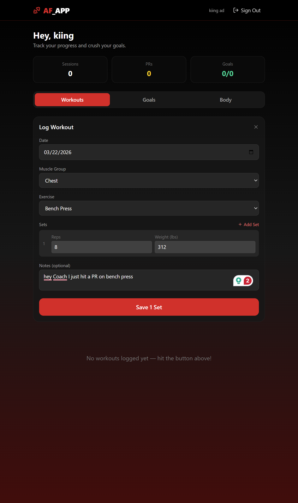
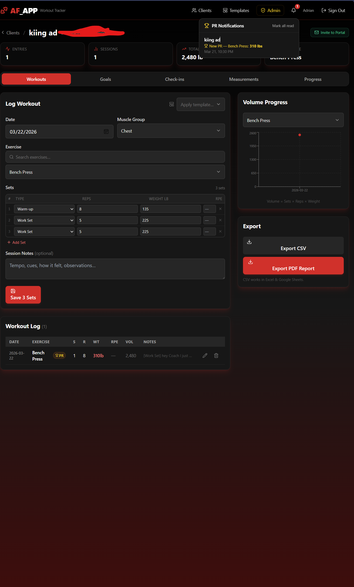

# AF Trainer — Gym Management Platform for Personal Trainers

> **Free, open-source, production-ready.** A full-stack PWA that replaces spreadsheets, paper notes, and expensive software for personal trainers managing real clients.

**Live:** [aftrainer.app](https://aftrainer.app) · **Repo:** [github.com/Adrianbrou/af_app](https://github.com/Adrianbrou/af_app)

---

## The Problem

Personal trainers track client workouts in spreadsheets, WhatsApp threads, and paper notebooks. When managing a roster of 10+ clients across multiple trainers, that breaks down fast:

- Which weight did this client lift last week?
- Did they hit a PR today?
- How close are they to their goal?
- Who's responsible for which client?

AF Trainer solves all of this — purpose-built for how real trainers actually work, completely free.

---

## Screenshots

### Trainer Side










### Client Portal (Mobile)




---

## Features

### Client Management

- Add and manage unlimited clients with full profiles
- Track training level (Beginner / Intermediate / Advanced), primary goal, start date, notes
- Active / inactive status — filter your roster at a glance
- Dashboard stats: total clients, active, inactive

### Workout Logging

- Log sets, reps, weight, RPE (Rate of Perceived Exertion), and session notes
- Per-set type builder — Warm-up, Work Set, Back-off sets logged individually
- 60+ exercises organized by muscle group with live search
- Inline edit — correct any entry without re-logging
- **Automatic PR detection** — trophy badge auto-appears when a personal record is broken

### Workout Templates

- Create reusable routines (e.g. "Push Day A", "Heavy Back Day")
- Set exercises with sets, reps target, and weight target
- Apply any template to a client session in one click

### Goal Tracking

- Goal types: Lift PR, Body Weight, Body Fat %, or Custom
- Set baseline → target values with a deadline
- Auto-progress bars — pull current data from workouts and measurements automatically
- Days remaining, overdue flags, mark achieved

### Session Check-ins

- Log session notes with mood (1–5) and energy (1–5) scores
- Types: Session, General, Nutrition, Call
- Full chronological feed per client

### Body Measurements

- Track 12 measurement points: weight, body fat %, neck, shoulders, chest, bicep, forearm, waist, hips, glutes, thigh, calf
- Body weight trend chart auto-updates as you log

### Progress & Analytics

- Volume progress chart per exercise (sets × reps × weight over time)
- Personal Records leaderboard per client
- Per-client stats bar: total entries, sessions, total volume, top exercise

### Export

- **CSV export** — opens in Excel / Google Sheets
- **PDF progress report** — full client history formatted for sharing

### Client Portal

- Invite clients to their own portal via **magic link email** (no password needed)
- Clients see only their own data: workouts, goals, body measurements
- Clients can log their own workouts directly from their phone
- When a client breaks a PR — **trainer receives a real-time notification** (bell icon in nav)

### Admin Panel (Multi-Trainer)

- 3-tier role system: Trainer → Admin → Super Admin
- See all trainers and their client rosters in one view
- **Transfer clients between trainers** — all history moves atomically
- Promote / demote trainer roles

### PWA — Installs Like a Native App

- Add to Home Screen on iPhone, Android, iPad — no App Store needed
- Service worker caching via Workbox — app shell loads offline
- Fully responsive — optimized for mobile touch with no zoom issues

---

## Tech Stack

| Layer | Technology |
|---|---|
| Frontend | React 19 + Vite (Rolldown) + Tailwind CSS 3 |
| Backend / DB | Supabase (PostgreSQL + Auth + RLS) |
| Auth | Supabase Auth — email/password + magic link |
| Charts | Recharts |
| PWA | vite-plugin-pwa + Workbox |
| PDF Export | jsPDF |
| Routing | React Router v6 |
| Email | Resend (custom SMTP — noreply@aftrainer.app) |
| Deployment | Vercel (auto-deploy on push to main) |
| DNS | Cloudflare |
| Mobile (native) | Capacitor (Android configured) |

---

## Security

- **Row Level Security (RLS)** — trainers only see their own clients. Clients only see their own data. Enforced at the database level, not just the frontend.
- `is_admin()`, `is_client()`, `my_client_id()` — Postgres security definer functions used in all RLS policies
- `auto_link_client_profile()` — trigger that automatically links a new auth account to the correct client record by email
- Auth tokens managed by Supabase — never stored in localStorage
- All env vars gitignored — no credentials in source control

---

## Database Schema

```
profiles              — role (trainer|admin|super_admin|client), full_name, client_id FK
clients               — trainer_id FK, name, email, phone, training_level, primary_goal, is_active
workout_entries       — client_id FK, trainer_id FK, date, exercise, muscle_group, sets, reps, weight, rpe, notes
body_measurements     — weight_lbs, body_fat_pct, neck, shoulders, chest, bicep, forearm, waist, hips, glutes, thigh, calf
client_goals          — type, baseline, target, target_unit, deadline, status, current_value
client_checkins       — type, body, mood_score, energy_score
workout_templates     — trainer-owned named templates
template_exercises    — exercises per template (sets, reps target, weight target)
pr_notifications      — trainer PR inbox: client PRs (exercise, new_weight, read flag)
```

---

## Local Setup

```bash
git clone https://github.com/Adrianbrou/af_app.git
cd af_app
npm install
```

Create `.env.local`:

```
VITE_SUPABASE_URL=https://your-project.supabase.co
VITE_SUPABASE_ANON_KEY=your-anon-key
```

Run SQL migrations in Supabase SQL Editor in order:

1. `supabase/migrations/001_initial.sql`
2. `supabase/migrations/002_additions.sql`
3. `supabase/migrations/003_measurements_expanded.sql`
4. `supabase/migrations/004_admin.sql`
5. `supabase/migrations/005_client_portal.sql`
6. `supabase/migrations/006_client_portal_trigger.sql`

In Supabase → Authentication → URL Configuration, add to **Redirect URLs**:

```
https://your-domain.com/portal
```

```bash
npm run dev
```

---

## Project Structure

```
src/
├── pages/
│   ├── LoginPage.jsx         # Login / forgot password
│   ├── DashboardPage.jsx     # Client roster with stats
│   ├── ClientDetailPage.jsx  # 5-tab client view + invite to portal
│   ├── TemplatesPage.jsx     # Workout template builder
│   ├── AdminPage.jsx         # Role management + client transfer
│   └── ClientPortalPage.jsx  # Client-facing portal (workouts/goals/body)
├── hooks/
│   ├── useClients.js         # Client CRUD
│   ├── useWorkouts.js        # Workout entry CRUD + PR detection
│   ├── useMeasurements.js    # Body measurements CRUD
│   ├── useGoals.js           # Goal CRUD + progress calculation
│   ├── useCheckIns.js        # Check-in CRUD
│   ├── useTemplates.js       # Template + exercise CRUD
│   └── useAdmin.js           # Admin: trainers, transfer, role management
├── context/
│   ├── AuthContext.jsx       # Session, profile, clientRecord, role flags
│   └── ToastContext.jsx      # Global toast notifications
├── components/
│   ├── Layout.jsx            # Header/nav (trainer view + client view)
│   ├── ProtectedRoute.jsx    # Auth guard
│   └── ui/                   # Button, Card, Input, Select, Label, Textarea
├── constants/
│   └── exercises.js          # 60+ exercises organized by muscle group
└── lib/
    └── supabase.js           # Supabase client init
```

---

## Build & Deploy

```bash
npm run build    # production build → dist/
npm run preview  # preview locally
```

Vercel auto-deploys on every push to `main`. DNS managed via Cloudflare.
